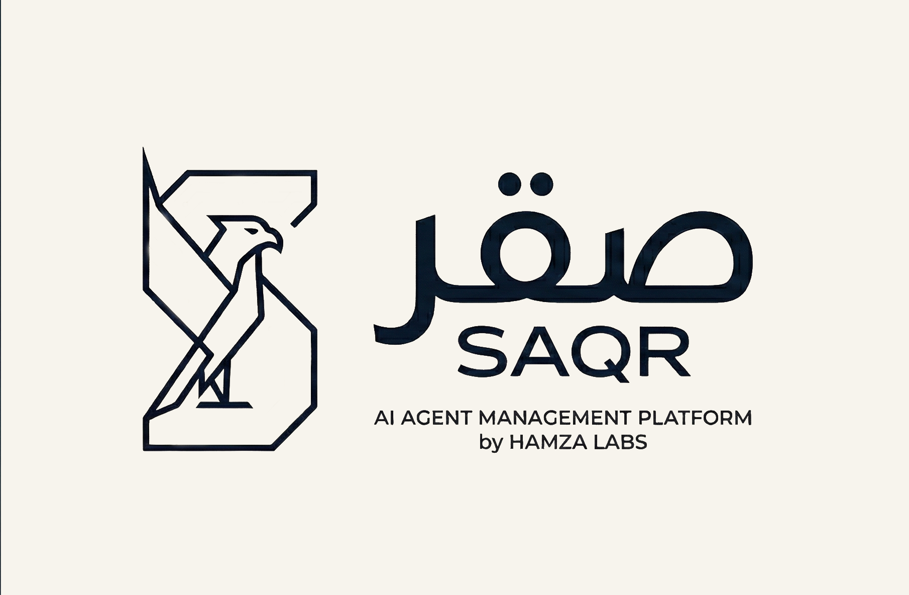

<p align="center">
  
</p>

<h1 align="center">Saqr صقر</h1>

<p align="center">
  <strong>Agent management platform by <a href="https://github.com/Hamza-Labs-Core">Hamza Labs</a></strong><br/>
  Orchestrate, observe, and control AI coding agents from anywhere — terminal, desktop, or phone.<br/>
  Zero-knowledge encrypted sync across machines.
</p>

## Packages

| Package | Description | Tests |
|---------|-------------|-------|
| `shared` | Event types, discriminated unions, sync protocol | 101 |
| `gc-core` | Event store foundation (bash+jq write, Node.js projections read) | 29 |
| `daemon` | AgentContext daemon — hooks, orchestration, security, codeguard | 774 |
| `sync-client` | E2EE push/pull sync (XChaCha20-Poly1305, Argon2id key recovery) | 135 |
| `sync-server` | Cloudflare Workers + Durable Objects — auth, sync, GDPR, telemetry | 331 |
| `admin-server` | Cloudflare Workers admin API — curated rules, user management | 31 |
| `dashboard` | Local web dashboard with SSE streaming | 109 |
| `cli` | `saqr` CLI — session rendering, themes, timeline | 260 |
| `terminal-ui` | Terminal-faithful UI components for rendering agent sessions | 79 |
| `mobile` | React Native / Expo — voice input, offline sync, web + native | 327 |
| `desktop` | Tauri 2 IPC bridge, tray, notifications, secure key storage | 237 |
| `github` | GitHub App integration — webhooks, PRs, issues, repo browser | 147 |
| `website` | Marketing site — React Router v7 SSR on Cloudflare Workers | 27 |
| `installer` | SaqrNest standalone server builders (macOS .pkg, Linux .deb, Windows SEA) | 8 |

**2,595 tests** across 14 packages.

## Architecture

```
You (phone / desktop / web)
       │
       ▼ E2EE (XChaCha20-Poly1305)
┌──────────────┐     ┌───────────────┐
│  Sync Server │     │  Admin Server │
│  (CF Worker) │     │  (CF Worker)  │
└──────┬───────┘     └───────────────┘
       │  Shared KV: AUTH_KV, REGISTRY_KV
       ▼
┌──────────────┐
│    Daemon    │  Your machine
│  ┌────────┐  │
│  │ Hooks  │◄─── Claude Code / Cursor / Codex
│  │ Events │  │
│  │ Agents │  │
│  │Codeguard│ │  Anti-pattern detection hooks
│  └────────┘  │
└──────────────┘
       │
       ▼
┌──────────────┐
│   gc-core    │  CQRS event store
│  bash write  │  (bash = fast writes,
│  node read   │   TS daemon = read-side)
└──────────────┘
```

## CI/CD

Every push triggers the full pipeline — no feature flags, everything builds:

- **PR Deploy** — prerelease builds + preview deploys on every PR
- **Release** — production builds + deploys on merge to `main`

| Target | Artifacts |
|--------|-----------|
| Android | `.apk` |
| iOS Simulator | `.ipa` |
| macOS Desktop | `.dmg` |
| Windows Desktop | `.exe` (NSIS) |
| Linux Desktop | `.AppImage` `.deb` |
| SaqrNest macOS | `.pkg` |
| SaqrNest Windows | `.exe` (SEA) |
| SaqrNest Linux | `.deb` |
| Servers | Cloudflare Workers (sync, admin) |
| Web Client | Cloudflare Workers (Expo web) |
| Website | Cloudflare Workers (React Router SSR) |

## Key Technical Decisions

- **CQRS architecture** — bash scripts for fast write side, TypeScript daemon for read-side projections
- **XChaCha20-Poly1305** for E2EE via libsodium-wrappers-sumo
- **Argon2id** (m=64MB, t=3, p=1) for passphrase-based key recovery
- **HKDF** (Extract+Expand) for key derivation in e2ee-relay
- **12 unified event types** across all agent providers
- **GDPR Art. 7** consent management with opt-in telemetry
- **Codeguard** — anti-pattern detection hooks with server-backed rule registry

## Stories

All 15 stories implemented:

| # | Story | Package(s) |
|---|-------|------------|
| 01 | Session attach mode | daemon |
| 02 | CLI session rendering | cli |
| 03 | Multi-agent hook system | daemon, cli |
| 04 | Event store projections | gc-core, daemon |
| 05 | Agent process orchestration | daemon |
| 06 | Local dashboard | dashboard |
| 07 | Encrypted cloud sync | sync-client |
| 08 | Mobile app | mobile |
| 09 | Desktop app | desktop |
| 10 | GitHub integration | github |
| 11 | Sync server | sync-server |
| 12 | Security & encryption | daemon |
| 13 | GDPR compliance | sync-server, daemon |
| 14 | Codeguard registry | sync-server, daemon |
| 15 | Admin server | admin-server |

## Development

```bash
pnpm install
pnpm test                           # run all tests
pnpm --filter <package> run test    # run tests for a package
pnpm --filter daemon run test       # example: daemon (774 tests)
```

## Acknowledgements

Inspired by [Paseo](https://github.com/nichochar/paseo) — the original vision for agent observation and management.

## License

MIT
